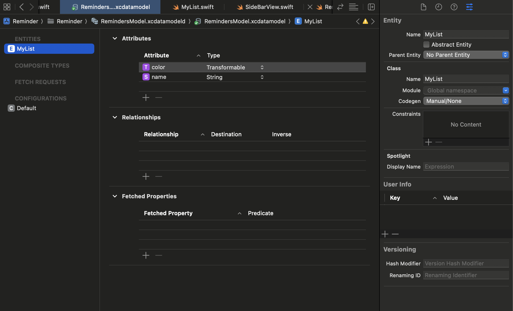
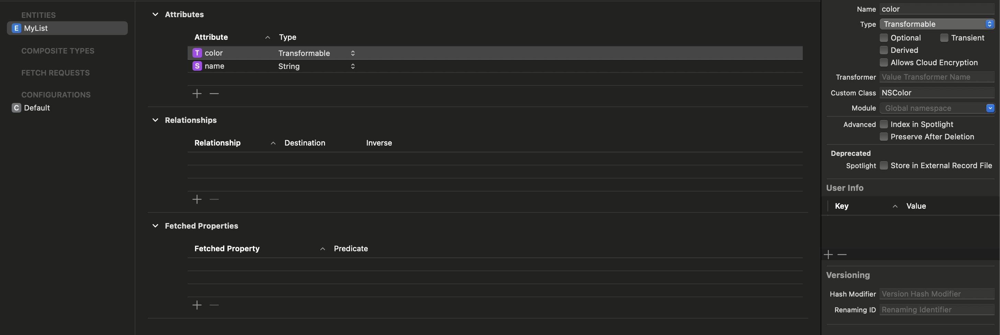
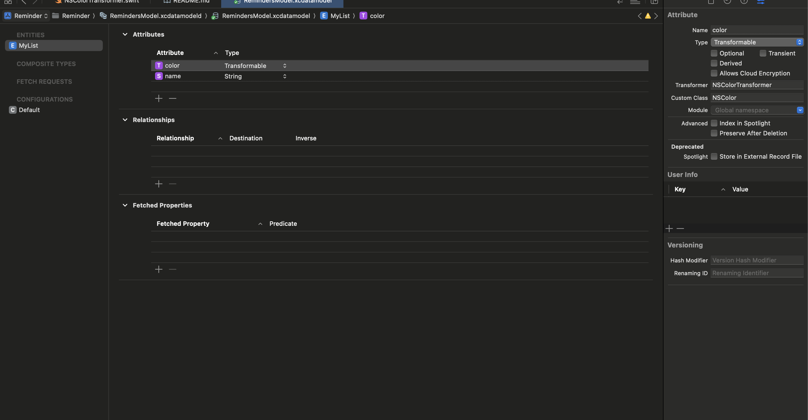
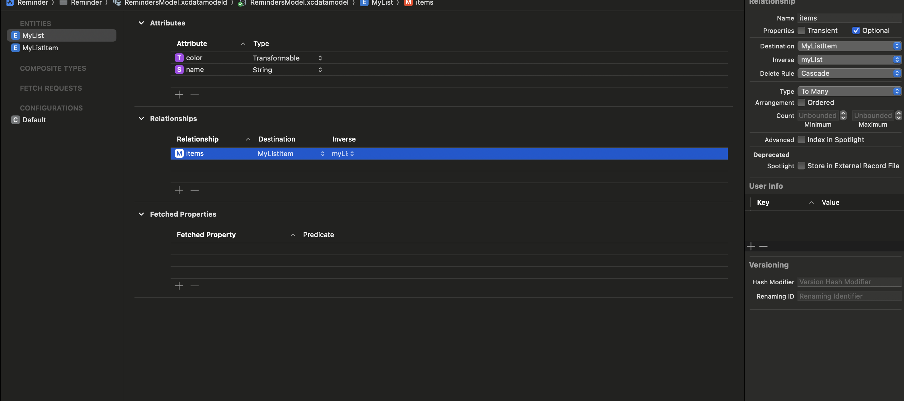
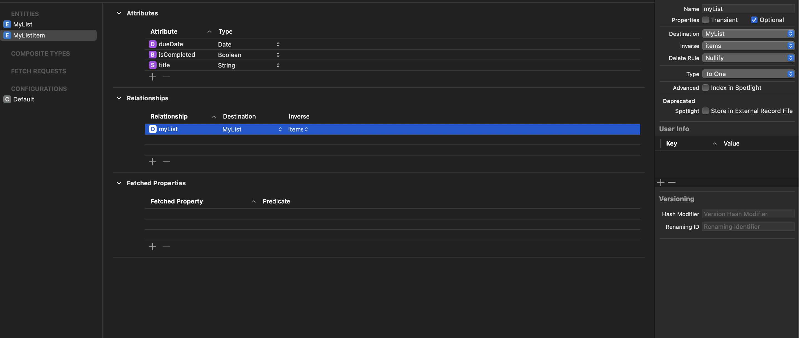

### Set Up Two Column Layout 

```swift
NavigationView {
    Text("Side Bar")
    Text("My List Item")
} //: NavigationView
```

### Define Manually Your CoreData Model



```swift
import Foundation
import CoreData
import AppKit

@objc(MyList)
class MyList: NSManagedObject {
    
}

extension MyList {

    @nonobjc public class func fetchRequest() -> NSFetchRequest<MyList> {
        return NSFetchRequest<MyList>(entityName: "MyList")
    }

    @NSManaged public var color: NSColor?
    @NSManaged public var name: String?

}

extension MyList : Identifiable {

}

```


### Transformermable for CoreData

1) Set Field of Your CoreData Model as Transformable



2) Write Transformer 

```swift

import Foundation
import AppKit

final class NSColorTransformer: ValueTransformer {
    
    override func transformedValue(_ value: Any?) -> Any? {
        guard let color = value as? NSColor else { return nil }
        do {
            let data = try NSKeyedArchiver.archivedData(withRootObject: color, requiringSecureCoding: true)
            return data
        } catch {
            print(error)
            return nil
        }
    }
    
    override func reverseTransformedValue(_ value: Any?) -> Any? {
        guard let data = value as? Data else { return nil }
        do {
            let color = try NSKeyedUnarchiver.unarchivedObject(ofClass: NSColor.self, from: data)
            return color
        } catch {
            print(error)
            return nil
        }
    }
    
}
```

3) Register Your Transformer



4) Register it on Your Coredata stack 

```swift
import Foundation
import CoreData

final class CoreDataManager {
    
    let persistentContainer: NSPersistentContainer
    static let shared = CoreDataManager()
    
    private init() {
        
        ValueTransformer.setValueTransformer(NSColorTransformer(), forName: NSValueTransformerName("NSColorTransformer"))
        
        self.persistentContainer = NSPersistentContainer(name: "RemindersModel")
        self.persistentContainer.loadPersistentStores { desc, error in
            if let error {
                fatalError("Unable to initialize Core Data \(error)")
            }
        }
    }
    
}

```

### MacOS Modal

- It looks like dialogs 
- Use `sheet`

```swift
struct SideBarView: View {
    
    @Environment(\.managedObjectContext) private var viewContext
    
    @State private var isPresented = false
    
    var body: some View {
        VStack(alignment: .leading) {
            Text("All Items Count 10")
            
            List(1...5, id: \.self) { index in
                Text("List: \(index)")
            }
            
            Spacer()
            
            Button {
                self.isPresented.toggle()
            } label: {
                HStack {
                    Image(systemName: Constants.Icons.plusCircle)
                    Text("Add List")
                } //: HStack
            }
            .sheet(isPresented: self.$isPresented, content: {
                AddNewListView(vm: AddNewListViewModel(
                    context: self.viewContext))
            })
            .buttonStyle(.plain)
            .padding()

            
        } //: VStack
    } //: body
}
``` 

### ContextMenu for right click Options 

```swift
    .contextMenu(ContextMenu(menuItems: {
        Button {
            self.vm.delete(myList)
        } label: {
            Label("Delete", systemImage: "trash")
        }

    }))
```

### Define One To Many Relationship 

1) Create Relationship on Parent 



- Define Destination 
- Define Delete Rule 
    - Cascase means when parent is deleted, all the related items are deleted as well.
- Define Type. "to Many" 

2) Create Relationship on Children 



- Define Destination
- Define Type. "to One"

3) If you created CoreData class by yourself, then you must add children manually.

```swift
    @NSManaged public var items: NSSet?
```

```swfit
 @objc(MyList)
public class MyList: NSManagedObject, BaseModel {
    
    static var all: NSFetchRequest<MyList> {
        let request: NSFetchRequest<MyList> = MyList.fetchRequest()
        request.sortDescriptors = []
        return request
    }
    
}

extension MyList {

    @nonobjc public class func fetchRequest() -> NSFetchRequest<MyList> {
        return NSFetchRequest<MyList>(entityName: "MyList")
    }

    @NSManaged public var color: NSColor?
    @NSManaged public var name: String?
    @NSManaged public var items: NSSet?

}

extension MyList : Identifiable {

}

```

### Two Column Layout Behavior 

- NavigationView 

```swift
struct HomeScreen: View {
    var body: some View {
        NavigationView {
            SideBarView()
            Text("My List Item")
        } //: NavigationView
    } //: body
}

```

- Sidebar 
```swift
import SwiftUI

struct SideBarView: View {
    
    @Environment(\.managedObjectContext) private var context
    
    @State private var isPresented = false
    
    var body: some View {
        VStack(alignment: .leading) {
            Text("All Items Count 10")
            
            MyListsView(vm: MyListsViewModel(context: self.context))
            
            Spacer()
            
            Button {
                self.isPresented.toggle()
            } label: {
                HStack {
                    Image(systemName: Constants.Icons.plusCircle)
                    Text("Add List")
                } //: HStack
            }
            .sheet(isPresented: self.$isPresented, content: {
                AddNewListView(vm: AddNewListViewModel(
                    context: self.context))
            })
            .buttonStyle(.plain)
            .padding()

            
        } //: VStack
    } //: body
}

#Preview {
    SideBarView()
}

```

```swift
struct MyListsView: View {
    
    @StateObject private var vm: MyListsViewModel
    
    init(vm: MyListsViewModel) {
        self._vm = StateObject(wrappedValue: vm)
    }
    
    var body: some View {
        VStack(alignment: .leading, spacing: 0) {
            List {
                Text("My Lists")
                ForEach(self.vm.myLists) { myList in
                    
                    NavigationLink {
                        Text("Destination")
                    } label: {
                        HStack {
                            let systemName = Constants.Icons.line3HorizontalCircleFill
                            Image(systemName: systemName)
                                .font(.title)
                                .foregroundStyle(myList.color)
                            Text(myList.name)
                        } //: HStack
                    } //: NavigationLink
                    .contextMenu(ContextMenu(menuItems: {
                        Button {
                            self.vm.delete(myList)
                        } label: {
                            Label("Delete", systemImage: "trash")
                        }
                    }))
                } //: ForEach
            } //: List
        } //: VStack
    }
}
```
=> Here in Navigation Link, it shows MainView.. 

SideBar NavigationLink => Renders Main, in two column layout 


### MacOS DropDown And PopOver 

```swift
enum DueDate {
    case today
    case tomorrow
    case yesterday
    case custom(Date)
}

extension DueDate {
    
    var value: Date {
        switch self {
        case .today: return Date.today
        case .tomorrow: return Date.tomorrow
        case .yesterday: return Date.yesterday
        case .custom(let date): return date
        }
    }
    
    var title: String {
        switch self {
        case .today: return "Today"
        case .tomorrow: return "Tomorrow"
        case .yesterday: return "Yesterday"
        case .custom(let date): return date.formatAsString
        }
    }
    
    var isPastDue: Bool { self.value < Date() }
    
    static func from(value: Date) -> DueDate {
        let calendar = NSCalendar(identifier: .gregorian)!
        if calendar.isDateInToday(value) {
            return DueDate.today
        } else if calendar.isDateInTomorrow(value) {
            return DueDate.today
        } else if calendar.isDateInYesterday(value) {
            return DueDate.yesterday
        } else {
            return DueDate.custom(value)
        }
    }
    
}

extension Date {
    
    static var today: Date { Date() }
    static var yesterday: Date { Calendar(identifier: .gregorian).date(byAdding: .day, value: -1, to: self.today)! }
    static var tomorrow: Date { Calendar(identifier: .gregorian).date(byAdding: .day, value: 1, to: self.today)! }
    var formatAsString: String {
        let formatter = DateFormatter()
        formatter.dateFormat = "MM/dd/yyyy"
        return formatter.string(from: self)
    }
    
}


struct DueDateSelectionView: View {
    
    @Binding var dueDate: DueDate?
    @State private var selectedDate = Date.today
    @State private var showCalendar = false
    
    var body: some View {
        Menu {
            Button {
                self.dueDate = .today
            } label: {
                VStack {
                    Text("Today \n \(Date.today.formatAsString)")
                } //: VStack
            }
            
            Button {
                self.dueDate = .tomorrow
            } label: {
                VStack {
                    Text("Tomorrow \n \(Date.today.formatAsString)")
                } //: VStack
            }
            
            Button {
                self.showCalendar.toggle()
            } label: {
                VStack {
                    Text("Custom")
                } //: VStack
            }
            
        } label: {
            let title = self.dueDate == nil ? "Add Date:" : self.dueDate!.title
            Label(title, systemImage: "calendar")
        } //: Menu
        .menuStyle(.borderedButton)
        .fixedSize()
        .popover(isPresented: self.$showCalendar, content: {
            DatePicker("Custom",
                       selection: self.$selectedDate,
                       displayedComponents: .date)
            .labelsHidden()
            .datePickerStyle(.graphical)
            .onChange(of: self.selectedDate, { _, newValue in
                self.dueDate = .custom(newValue)
                self.showCalendar = false
            })
        })
    } //: body
}
```

### MacOS onHover 

```swift
        .onHover(perform: { hovering in
            self.active = hovering
        })
```

```swift
struct ListItemCell: View {
    
    @State private var active = false
    let item: MyListItemViewModel
    
    var body: some View {
        HStack(alignment: .firstTextBaseline) {
            Image(systemName: Constants.Icons.circle)
                .font(.system(size: 14))
                .opacity(0.2)
            
            VStack(alignment: .leading) {
                Text(self.item.title)
                if let dueDate = self.item.dueDate {
                    Text(dueDate.title)
                        .opacity(0.4)
                        .foregroundStyle(dueDate.isPastDue ? .red : .primary)
                }
            } //: VStack
            
            Spacer()
            
            if self.active {
                Image(systemName: "multiply.circle")
                    .foregroundStyle(.red)
                Image(systemName: Constants.Icons.exclaimationMarkCircle)
                    .foregroundStyle(.purple)
            }
            
        } //: HStack
        .contentShape(Rectangle())
        .onHover(perform: { hovering in
            self.active = hovering
        })
    } //: body
} //: ListItemCell
```

### MacOS PopOver

```swift
    Image(systemName: Constants.Icons.exclaimationMarkCircle)
        .foregroundStyle(.purple)
        .onTapGesture {
            self.showPopOver.toggle()
        }
        .popover(isPresented: self.$showPopOver, arrowEdge: .leading, content: {
            Text("Hello World")
        })
```
